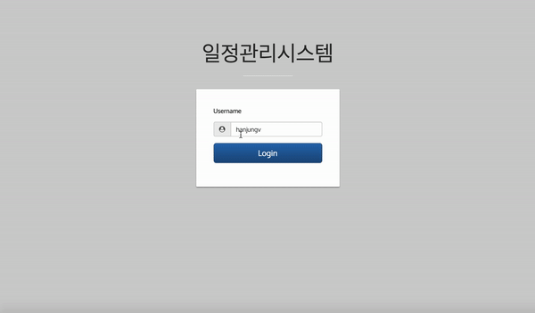
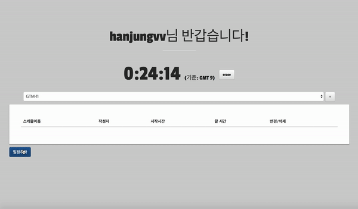

## 있어야 하는 기능
* 이름으로 로그인
* 시간 GMT기준으로 추가 제거

* 일정 중복되지 않게 생성, 업데이트, 제거

### 추가적으로 사용한 라이브러리
* moment.js : [https://momentjs.com/](https://momentjs.com/)
* Bootstrap : [http://getbootstrap.com/](http://getbootstrap.com/)
* jQuery

ptyhon : https://gist.github.com/hanjungv/b257752bc2995c2ebbf652cd65b85969
